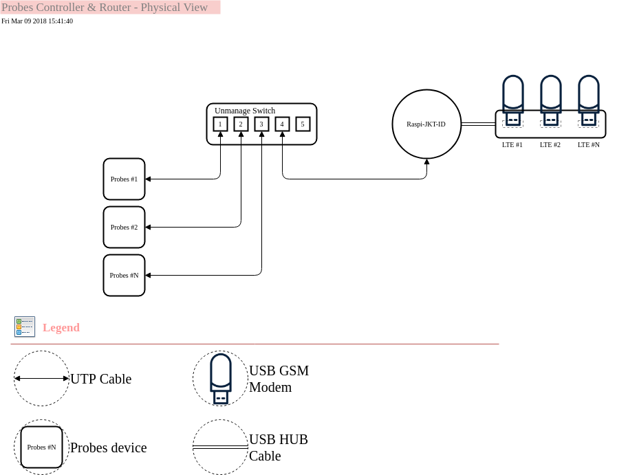

GSM Modem Autoprobes for RIPE
=============================

## Prerequisite
* Raspberry Pi 3 or another ARM as Controller & Router 
* Unmanaged switch hub
* RIPE Atlas Probes v3 or latest
* USB LTE Modems
* USB HUB (if necessary)

## Testbed
* Raspberry Pi 3 with [Fedora Core 27 ARM](https://arm.fedoraproject.org/))
* Unmanaged Switch HUB 8 port
* RIPE Atlas Probes (2 devices)
* USB LTE Modems (2 devices)

## Diagram


## Quick Start
```
$ sudo dnf install ModemManager NetworkManager -y
$ git clone ~dewanggaalam/gsm-ripe.git
$ cd gsm-ripe 
$ chmod +x gsm-ripe/gsm-ripe.sh
$ sh gsm-ripe.sh
```

## Logic Output from controller

Raspberry Pi 3 setup as router, make sure you change `net.ipv4.ip_forward` to `1`. And create `masquerade` to all interface that physically connected.

### Show routing table
```
$ sudo ip route show table all | grep "table" | grep -v "local" 
default via 10.229.241.1 dev wwan0 table INDOSATOOREDOO 
default via 10.211.132.202 dev wwan1 table XL 
```

### Show rule

```
$ sudo ip rule ls table INDOSATOOREDOO && ip nei sh | grep 192.168.255.4
32764:	from 192.168.255.4 lookup INDOSATOOREDOO 
192.168.255.4 dev eth0 lladdr 18:d6:c7:2a:05:a2 STALE
$ sudo ip rule ls table XL && ip nei sh | grep 192.168.255.5
32765:	from 192.168.255.5 lookup XL 
192.168.255.5 dev eth0 lladdr 14:cc:20:48:ca:f0 REACHABLE
```

We can saw, the output is mapping from each probes to each WAN/GSM Provider using route table.

## Demo
### Probing Modem(s)
[](https://asciinema.org/a/WjbOtwqsQgF4hecD65LwidMFL)

### Detected Modem(s)
[](https://asciinema.org/a/ETAefiIVY6joyV6YwAGGqqUpY)


## TO DO
* `udev` trigger the scripts after usb modem attached
* bundled script using rpm for general purpose and pushed to copr repository

## LICENSE
```
        DO WHAT THE FUCK YOU WANT TO PUBLIC LICENSE 
                    Version 1, Aug 1945 

 Copyright (C) 1945 Dewangga Alam <dewanggaba@xtremenitro.org> 

 Everyone is permitted to copy and distribute verbatim or modified 
 copies of this license document, and changing it is allowed as long 
 as the name is changed. 

            DO WHAT THE FUCK YOU WANT TO PUBLIC LICENSE 
   TERMS AND CONDITIONS FOR COPYING, DISTRIBUTION AND MODIFICATION 

  0. You just DO WHAT THE FUCK YOU WANT TO. ```